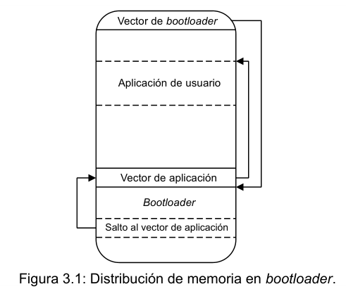
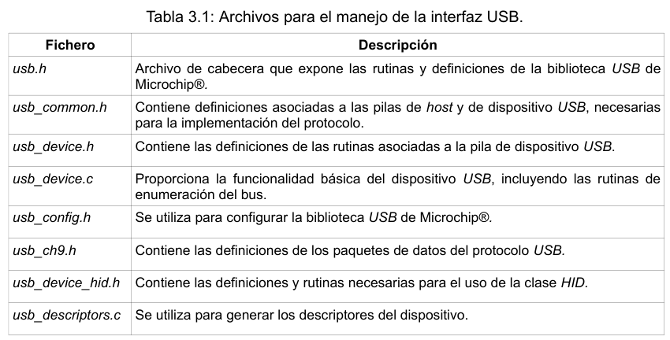
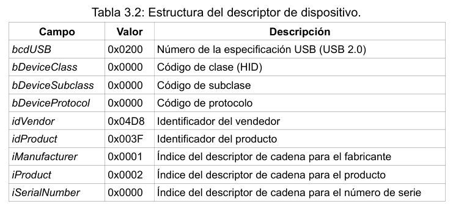
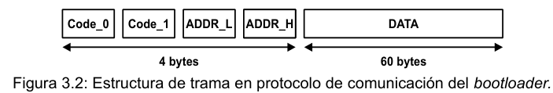
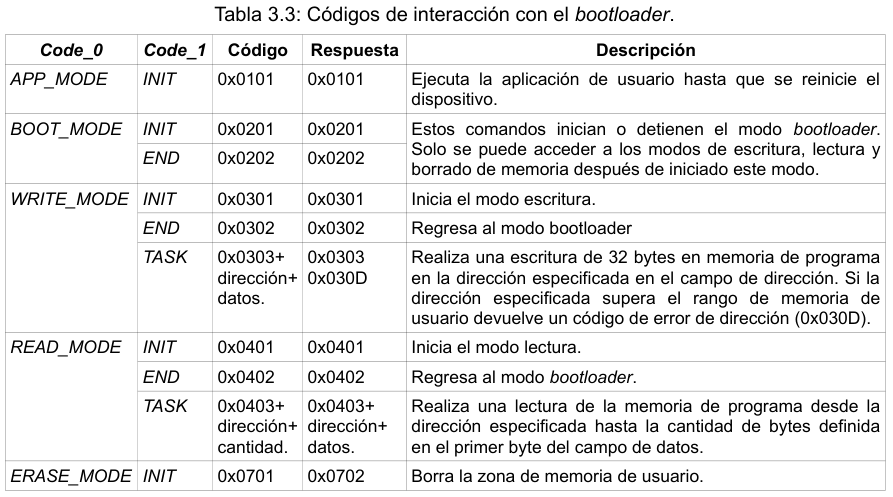
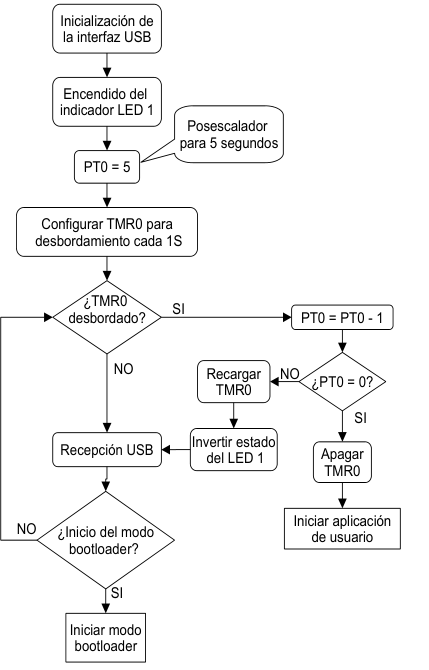
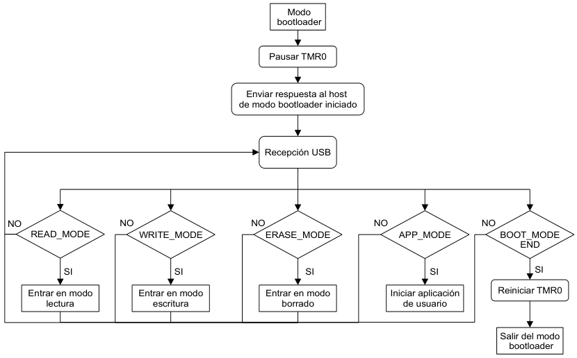

# FreeBootloader PIC18F

Para esta aplicación el usuario debe ser capaz de reprogramar el equipo de la manera más rápida y sencilla posible. Además, este debe sentirse ajeno al trabajo directo con el microcontrolador, sus periféricos y el hardware que compone el sistema en general. Debido a esto es conveniente utilizar un bootloader, evitando así que el usuario se vea obligado a cargar el programa con un programador. En este caso el medio de comunicación usado para la interacción con el bootloader es la interfaz USB disponible en el PIC18F4550.

El bootloader diseñado se basa en la estructura del “USB HID Bootloader”, implementado en MikroC® por los desarrolladores de MikroElektronika®. En la Figura 3.1 se puede apreciar la forma en la que se distribuye la memoria principal en este bootloader, donde todas sus rutinas se ubican en las últimas direcciones de memoria. Al reiniciar el microcontrolador la primera instrucción ejecutada es un salto hacia la función principal del bootloader, donde se inicializa la interfaz USB y comienzan a ejecutarse todas las tareas que indique el host. Cuando terminan las rutinas del bootloader se realiza un salto hacia una zona de memoria donde se encuentra otro salto hacia la primera instrucción de la aplicación de usuario (vector de aplicación). En este caso el vector de aplicación y las rutinas del bootloader se encuentran a partir de la dirección 0x6800, dejando disponibles 26.624 kB para la aplicación de usuario.

## Configuración de la interfaz USB en PIC18F

Para el manejo de la interfaz USB con XC8 se utilizan los archivos de la Tabla 3.1, extraídos del paquete MLA. Estos archivos desarrollados por Microchip®, configuran la interfaz USB como una clase de dispositivo de interfaz humana (HID). Esta clase es utilizada por periféricos como teclados, ratones, controles para videoconsolas (joysticks), entre otros periféricos de interacción con una computadora. Una ventaja de utilizar esta clase es que el controlador del dispositivo ya viene instalado en la mayoría de los sistemas operativos por defecto.

### Descriptores

Los descriptores son los encargados de indicar al concentrador raíz del bus USB las distintas configuraciones de un periférico determinado. Estas configuraciones son definidas por el desarrollador y determinan el comportamiento del circuito, su detección y tratamiento por parte del sistema operativo. El descriptor de dispositivo es único para cada periférico y contiene información acerca del
dispositivo. Para configurar este descriptor se modifican en el fichero usb_descriptors.c los datos
del arreglo USB_DEVICE_DESCRIPTOR.

Todos los campos que comienzan con la letra i son de tipo índice (Tabla 3.2). Si el valor de un campo tipo índice es distinto de cero, significa que el dispositivo posee información consultable a través de descriptores de cadena. Como se puede apreciar en la Tabla 3.2 se definen los índices
de los descriptores de cadena de producto y fabricante. Un descriptor de cadena proporciona información en forma de texto que es usada por el sistema operativo para mostrar información adicional del dispositivo.

Para asignar el descriptor de cadena de producto es necesario modificar la estructura sd002 definida en el fichero usb_descriptors.c, colocando en el último campo el valor del texto deseado, en este caso “AutoUSB-KIT v6”. Se realiza el mismo procedimiento para modificar el descriptor de cadena de fabricante, pero esta vez modificando la estructura sd001, donde se asigna la cadena de caracteres “CUJAE/FIAB”.

## Confiuración de biblioteca USB

La biblioteca USB de Microchip® es compatible con varios microcontroladores y permite la implementación de distintas clases de dispositivos USB. El funcionamiento de esta biblioteca genérica se basa en inclusión de directivas del preprocesador que activan o desactivan partes del código cuando el usuario define ciertas macros en el archivo usb_config.h.

En el archivo usb_config.h es posible configurar que el manejo de las tareas del bus se realice por interrupción o por encuestas, definiendo las macros USB_INTERRUPT o USB_POLLING respectivamente. Para la confección del bootloader es conveniente que los vectores de interrupción no sean utilizados, de esta forma no es necesario redireccionarlos y a su vez se ahorra espacio en la memoria de programa. El uso de la configuración en modo encuesta trae consigo que cada vez que se desee efectuar una transferencia debe ser llamada la función USBDeviceTasks. Esta función es la principal máquina de estado de transacciones del dispositivo USB, encargada de las transferencias de control asociadas al proceso de enumeración, y de detectar varios eventos de la interfaz.

El fichero usb_device_hid.h proporciona dos funciones llamadas HIDRxPacket y HIDTxPaket que realizan las transferencias de datos. Estas funciones devuelven un puntero genérico que es definido por esta biblioteca como USB_HANDLE. Este puntero puede ser usado para verificar el estado de una transferencia (por ejemplo si se ha completado o está pendiente) utilizando la función USBHandleBusy. Por lo tanto, es necesario crear dos USB_HANDLE como variables globales para poder monitorear el estado de las trasferencias desde y hacia el dispositivo.

Como la configuración del modo encuesta exige que el usuario deba llamar a la función USBDeviceTasks en cada transferencia, se crea una función auxiliar con el nombre HID_transf. Esta función espera a que el bus termine una transacción si la está realizando, llama a las funciones HIDRxPacket o HIDTxPaket según el tipo de transferencia que el usuario desee realizar y llama a la función USBDeviceTasks. El usuario determina si llamar a la función HIDRxPacket o HIDTxPaket asignando un cero o un uno a la variable global HID_RT_sel. Tanto la variable HID_RT_sel, como la función HID_transf se encuentran en direcciones de memoria conocidas por el usuario; permitiendo así reutilizar el código de la interfaz USB del bootloader en la aplicación de usuario. Esto evita tener que ocupar espacio en la memoria de programa reimplementando rutinas ya definidas en el bootloader.

### Inicialización de la interfaz USB

Una vez realizadas las modificaciones anteriores es posible inicializar la conexión al bus USB llamando a la función USBDeviceInit y llamando por primera vez a la función USBDeviceTasks. De esta forma se configuran todos los registros de la interfaz para lograr la configuración especificada
y comienza el proceso de numeración del bus. En el caso de utilizar el modo interrupción no es necesario llamar a USBDeviceTasks, pero si a USBDeviceAttach, para iniciar el proceso de numeración del bus.

## Protocolo de comunicación

En el protocolo de comunicación implementado para la interacción con el bootloader, la aplicación de alto nivel en el host prepara un paquete de 64 bytes que al ser enviado siempre tiene una respuesta del dispositivo, si presenta la estructura de datos y códigos definidos en el protocolo.
Los paquetes de 64 bytes son interpretados como tramas con los cuatro primeros bytes definiendo dos campos de código y dos campos de dirección. El resto de bytes del paquete es usado como un campo de datos.

El campo Code_0 define los distintos modos en los que se pudiera encontrar el equipo, ya sea el modo aplicación (APP_MODE), bootloader (BOOT_MODE), escritura (WRITE_MODE), lectura (READ_MODE) o en modo borrado (ERASE_MODE). El campo Code_1 complementa al campo Code_0 y permite iniciar, detener o realizar tareas específicas en cada uno de los modos. La Tabla 3.3 muestra una descripción de cada uno de los modos y las respuestas que puede enviar el dispositivo en cada caso.

## Rutinas del Bottloader

El bootloader diseñado comienza con la inicialización de la interfaz USB y encendiendo el indicador LED del modo bootloader en el Módulo PLC. Realizado esto, comienza un ciclo de espera a que el host envíe la orden para iniciar el modo bootloader. Esta espera se realiza mediante encuestas al timer 0 en modo 16 bits y dura cinco segundos, en los cuales el indicador LED se mantiene parpadeando a una frecuencia de 1 Hz. De no recibirse la orden de inicio del modo bootloader, es llamado al modo aplicación. La Figura 3.4 muestra un diagrama de bloques de lo anteriormente descrito.

El bootloader diseñado comienza con la inicialización de la interfaz USB y encendiendo el indicador LED del modo bootloader en el Módulo PLC. Realizado esto, comienza un ciclo de espera a que el host envíe la orden para iniciar el modo bootloader. Esta espera se realiza mediante encuestas al timer 0 en modo 16 bits y dura cinco segundos, en los cuales el indicador LED se mantiene parpadeando a una frecuencia de 1 Hz. De no recibirse la orden de inicio del modo bootloader, es llamado al modo aplicación. La Figura 3.4 muestra un diagrama de bloques de lo anteriormente descrito.

___

<dezamora98@gmail.com>
